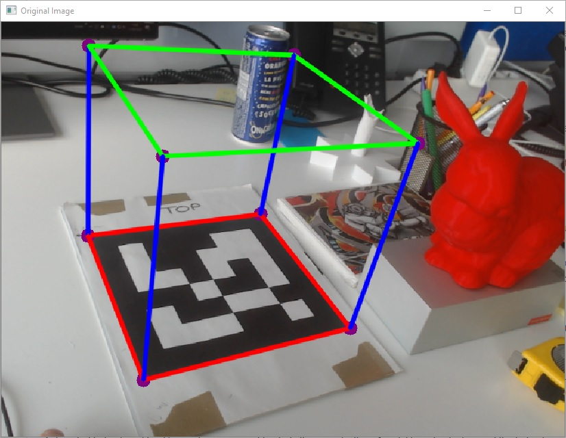

# DEPRECATED - This repo is no longer maintained

----

# SolAR Fiducial Marker

The SolAR **Fiducial Image Marker sample** shows a SolAR pipeline for augmented reality based on a fiducials markers image. This pipeline loads a reference image marker, then tries to detect it on real-time camera images and to estimate the pose of the camera in relation to the coordinate system of the image marker. If the marker is detected, the pipeline over the current camera image renders a 3D cube from a virtual camera which pose corresponds to the one estimated by the pipeline.

|  |  |
|:-:|:-:|
| SolARPipelineTest_FiducialMarker | SolARPipeline_FiducialMarker |

## How to run

* To run it, first print the marker [FiducialMarker.gif](./SolARPipeline_FiducialMarker/tests/SolARPipelineTest_FiducialMarker/FiducialMarker.gif)

* If you want to change your fiducial marker, you can edit the [fiducialMarker.yml](./SolARPipeline_FiducialMarker/tests/SolARPipelineTest_FiducialMarker/fiducialMarker.yml)

* If you want to change the calibration parameters of the camera, edit the [camera_calibration.json](./SolARPipeline_FiducialMarker/tests/SolARPipelineTest_FiducialMarker/camera_calibration.json)

* To change properties of the components of the fiducial pipeline, edit the [SolARPipelineTest_FiducialMarker_conf.xml](./SolARPipeline_FiducialMarker/tests/SolARPipelineTest_FiducialMarker/SolARPipelineTest_FiducialMarker_conf.xml) file.

If you want to run your Fiducial samples after having built them, do not forget to install the required dependencies if not already done:

<pre><code>remaken install packagedependencies.txt</code></pre>

and for debug mode:

<pre><code>remaken install packagedependencies.txt -c debug</code></pre>

For more information about how to install remaken on your machine, visit the [install page](https://solarframework.github.io/install/) on the SolAR website.

### SolARPipeline_FiducialMarker

* Open a terminal and execute from the `bin/Debug` or `bin/Release` folder:

> #### Windows
>
	SolARPipelineTest_FiducialMarker.exe

> #### Linux
>
	./run.sh ./SolARPipelineTest_FiducialMarker

### Plugin

You should have bundle every required library in your Unity project (`./Assets/Plugins`). Then from Unity Gameobject *PipelineLoader* you can load your configuration file for the natural image pipeline. You can directly edit parameters from Unity Editor's inspector.

## Contact 
Website https://solarframework.github.io/

Contact framework.solar@b-com.com

