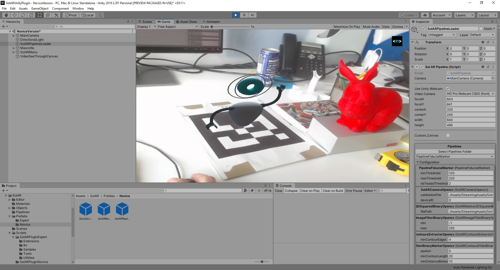

# SolAR Fiducial Marker

The SolAR **Fiducial Image Marker sample** shows a SolAR pipeline for augmented reality based on a fiducials markers image. This pipeline loads a reference image marker, then tries to detect it on real time camera images and to estimate the pose of the camera in relation to the coordinate system of the image marker. If the marker is detected, the pipeline draws a 3D cube on its position, renders the 3D cube from a virtual camera which pose corresponds to the one estimated by the pipeline, and displays the rendered 3D cube over the current camera image.

Here is a screenshot example of the Fiducial Image Marker pipeline:

|  |  |
|:-:|:-:|
| StandAlone | Plugin |

## How run it

* To run it, first print the marker `./StandAlone/FiducialMarker.gif`

* If you want to change your fiducial marker, you can edit the `fiducialMarker.yml`

* If you want to change the calibration parameters of the camera, edit the `camera_calibration.yml`

* To change properties of the components of the fiducial pipeline, edit the `*.xml` files.

### StandAlone

* Open a terminal and execute `./bin/Release/SolARFiducialMarkerSampleStandAlone.exe`
* Target your fiducial marker with your camera
* Press `escape` to quit the application

### Plugin

You should have bundle every required libraries in your Unity project (`./Assets/Plugins`). Then from Unity Gameobject *PipelineLoader* you can load your configuration file for the fiducial pipeline. You can directly edit parameters from Unity Editor's inspector.

## Contact 
Website https://solarframework.github.io/

Contact framework.solar@b-com.com

